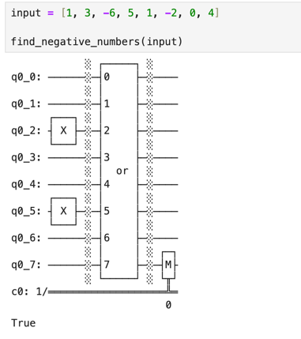
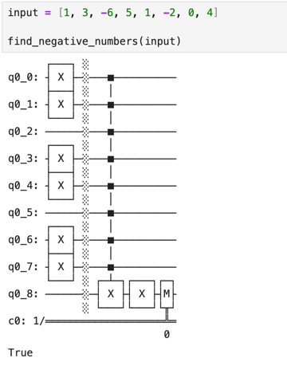
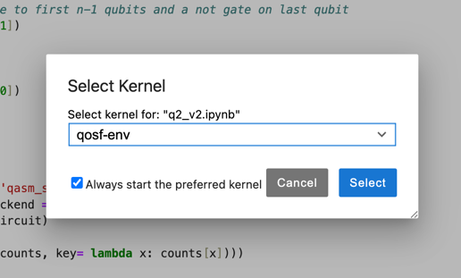

# QOSF Cohort 8 Screening Test
#### Annika Nel 
18 October 2023

## Task 2 Solution
The presence of negative numbers in a list can be detected by encoding each number 
as a qubit with state `|0⟩` or `|1⟩`, depending on the sign of the number. I have proposed 
two solutions to this problem, framing it either as an ‘or’ problem or an ‘and’ problem.

Both solutions were coded using qiskit, and can be found in the same directory as 
this README.

### Solution 1 - the OR approach
_Contained in `q2_v1.ipynb`_

For a list of size _n_, create _n_ qubits with state `|0⟩`.
Loop through the list of numbers and apply a NOT gate to the corresponding qubit if the 
number is _negative_, thereby flipping its state to `|1⟩`. In this way, we mark the 
qubits of interest. At this stage, we know that if any of our qubits have state `|1⟩`, 
there was a negative number in the list. Thus, we apply an OR gate to all the qubits
and store the result in the last qubit. Thereafter, when we measure the last qubit, 
it will have a state of `|1⟩` if and only if the list contained a negative number.

Here is an example of the output for an input list of [1, 3, -6, 5, 1, -2, 0, 4].



This solution uses `n` qubits for a list of size `n`, as well as one classical bit to store
the result. This will work for all integers, as only the sign is considered when creating the circuit.

### Solution 2 - the AND approach
_Contained in `q2_v2.ipynb`_

For a list of size _n_, create _n+1_ qubits with state `|0⟩`. Loop through the list of 
numbers and apply a NOT gate to the corresponding qubit if the number is equals 0 or 
is positive, thereby flipping its state to `|1⟩`. However, leave the last qubit (_n+1_)
untouched. Note that only the qubits which represent non-negative numbers will have a
state of `|1⟩`. Thus, if all the qubits have a state of `|1⟩`, there were no negative
numbers present in the list. Now we can use a multi-control Toffoli gate to effectively
AND all the qubits from index 0 to n and store the result in the target qubit at index _n+1_.
The target qubit will have a state of `|1⟩` if and only if all of the inputs were `|1⟩`, i.e.
if all the qubits represented non-negative numbers. Thus, we add a NOT gate to the target qubit to flip the
state and measure the result. Finally, given that we flipped the state of the target qubit,
a measurement of `|1⟩` will indicate the presence of negative numbers, while `|0⟩` indicates
that no negative numbers were present in the list.

Here is an example of the output for an input list of [1, 3, -6, 5, 1, -2, 0, 4].



This solution uses `n+1` qubits for a list of size `n`, as well as one classical bit to store
the result. Again, there is no reason this wouldn't work for all integers. However,
this solution seems slightly less efficient that the first, since it uses an additional qubit.
This additional overhead becomes negligible as _n_ grows. A further analysis of the source
code for qiskit's `OR` and `mct` gates may reveal which solution is more resource-efficient
at scale.

## Comments
Neither of these approaches will scale well for large lists. Some more investigation
will be needed to adapt them for large inputs. 

## Running the code
To run the code, open a terminal and run Jupyter in the current folder:
```
$ jupyter notebook
```

Thereafter, open the desired notebook and run the first cell of the notebook to create the
`find_negative_numbers` function. Then run any of cells with test input to see the function at work.

### If you don't have have qiskit installed...

Create a new virtual environment by running
```
$ python3 -m venv qosf-env
```
Now activate the virtual environment using
```
$ source qosf-env/bin/activate
```

Then install the required packages:
```
pip3 install -r requirements.txt
```

Thereafter, open the desired notebook and select `qosf-env` as the kernel:



Finally, run the cells in the notebook in order.